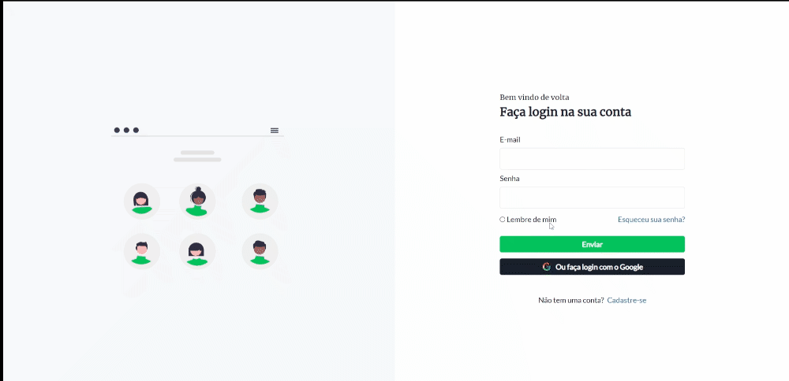

  

<h1 align="center">Codelândia | Tela de login</h1>

<h2 align="center">Descrição</h2>

  Quarto desafio da Comunidade Codelândia 

 <a href="#descricao">Descricão</a> •
 <a href="#tecnologias">Tecnologias</a> •

## 🛠️ Tecnologias

Principais tecnologias utilizadas no desenvolvimento do projeto:

- HTML
- CSS
- Media queries (responsividade)
---

Feito com 💙 por <a href="https://www.linkedin.com/in/kaykyvieraa/">Kayky Vieira</a>

